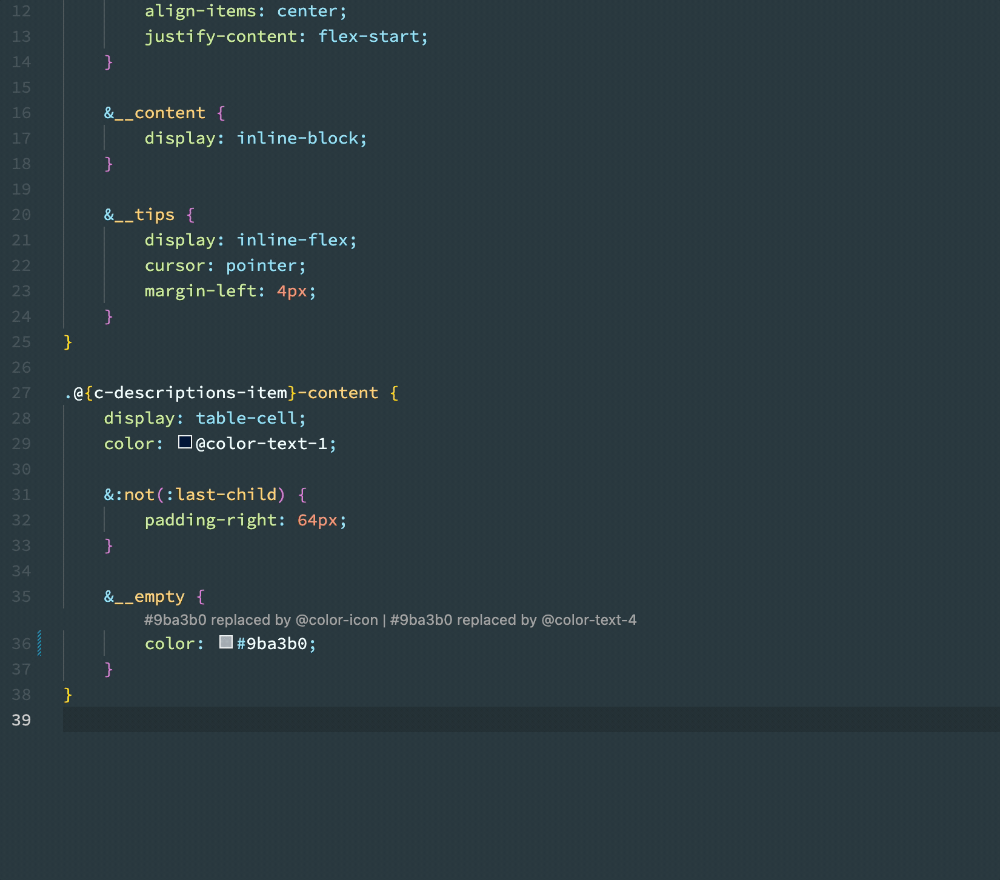

# mitra-design-theme-helper ｜ Mitra Design For Visual Studio Code

mitra-design-theme-helper 是 IDE 智能提示插件，拥有智能提示 Design Token、自动补全、悬浮提示、显示 Token 颜色等功能。

## 配置 JSON 路径

打开 VSCode 设置页面「快捷键 Command + ,」，搜索 mitra。如果需要修改路径，请改工作区的路径，以保证每个项目中不同路径都能够正常使用

注意：

默认 Token Meta 路径是 `node_modules/@mitra-design/theme/es/tokens/token-meta.json`

如果有使用 pnpm 安装的项目，需要将路径配置到真实安装的路径中，因为 pnpm node_modules 中是软链接，导致文件路径不正确。正确的像这样 `node_modules/.pnpm/@mitra-design+theme@2.5.0-alpha.50/node_modules/@mitra-design/theme/es/tokens/token-meta.json`

如何获取文件路径？（按下图复制相对路径即可

## READY

当重启 vscode 后，插件准备就绪时，右下角会弹出消息

## 功能演示

### 智能提示、自动补全

在 less 文件中，只要输入`: `、`空格`、`@` 就可以触发智能提示 ，比如颜色 token `@color-primary-6`，待选列表中有 token 的具体颜色表现、十六进制色值、token name 和描述

### 悬浮提示

鼠标悬浮到 Token 上，会有 Token 具体的描述以及值显示出来，如果是颜色 Token，还会有颜色选择器

### 自动替换

如果匹配到 Token 对应的色值，会在上方显示可替换的 Token 列表，点击即可完成替换

如果同一色值匹配到多个 Token，需要自行判断使用哪个 Token，比如下列场景，按照使用场景判断，应该使用文字的 Token，而不是 icon

